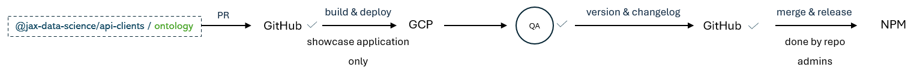

# Jax Data Science Components

<a alt="The Jackson Laboratory Logo" href="https://www.jax.org" target="_blank" rel="noreferrer">
    
</a> 

## *Overview*

The *JAX Data Science UI Components* repository is a development workspace designed to streamline the creation, testing and 
deployment of shareable UI components across the JAX Data Science community. This workspace employs development 
practices and tools that promote code reuse, reduce duplication, and ensure architectural consistency throughout the organization.

The workspace uses the Nx build system and has a [monorepo structure](https://angular.dev/reference/configs/file-structure#multiple-projects). 
There are two libraries - *@jax-data-science/components* and *@jax-data-science/api-clients*, one theme - *@jax-data-science/themes*, and one root application.

The workspace is maintained by the JAX Data Science UI/UX team and undergoes continuous updates to keep up with the 
latest technologies. This commitment to technological currency ensures that all shared UI components benefit from the latest performance 
improvements, security patches, and feature enhancements while also keeping backward compatibility.

## *Local Setup*
- Clone the workspace from the [GitHub](https://github.com/TheJacksonLaboratory/jds-ui-components) repository

Clone the repository, move to a branch and install the dependencies:

- Install the dependencies using [Node.js](https://nodejs.org/en/download/) and [npm](https://www.npmjs.com/get-npm)
```bash
npm install
```
- Start the development server locally
```bash
  npm run start
```

To test before pushing changes, use:

To start implementing your shared components, create a new module/directory in the **components** or **api-clients** 
libraries (like */components/my-new-component* or */api-clients/my-new-component*).

You can use the below Nx command: 
```bash
# ui-components
npx nx g @nrwl/angular:component --path=components/lib/my-new-component --export=true 

# clients-api
npx nx g @nrwl/angular:component --path=api-clients/lib/my-new-component --export=true 
```

You can use `npx nx list` to get a list of installed plugins. Then, run `npx nx list <plugin-name>` to learn about more specific capabilities of a particular plugin. Alternatively, [install Nx Console](https://nx.dev/getting-started/editor-setup?utm_source=nx_project&utm_medium=readme&utm_campaign=nx_projects) to browse plugins and generators in your IDE.

[Learn more about Nx plugins &raquo;](https://nx.dev/concepts/nx-plugins?utm_source=nx_project&utm_medium=readme&utm_campaign=nx_projects) | [Browse the plugin registry &raquo;](https://nx.dev/plugin-registry?utm_source=nx_project&utm_medium=readme&utm_campaign=nx_projects)


[Learn more about Nx on CI](https://nx.dev/ci/intro/ci-with-nx#ready-get-started-with-your-provider?utm_source=nx_project&utm_medium=readme&utm_campaign=nx_projects)

- create */src/pages/my-new-component* and update the */src/app/app-routing.module.ts* file to include the new component


- update the table in */src/app/pages/components-list/components-list.component.html* to include and link to your new component

[Learn more about this workspace setup and its capabilities](https://nx.dev/getting-started/tutorials/angular-standalone-tutorial?utm_source=nx_project&amp;utm_medium=readme&amp;utm_campaign=nx_projects) or run `npx nx graph` to visually explore what was created. Now, let's get you up to speed!

## Finish your CI setup

[Click here to finish setting up your workspace!](https://cloud.nx.app/connect/WMyxahRqU7)

- once the PR is approved, you will need to deploy the branch to the GCP instance, 
where the QA team will be able to test the component using the showcase application

<a alt="The Jackson Laboratory Logo" href="https://www.jax.org" target="_blank" rel="noreferrer">
    
</a> 

## *Releasing*
Once the component has been tested and approved by the QA team, you can proceed with releasing the component. 
You will need to: 
- update the version of the component in the **package.json** - each */components* 
and */api-clients* directory has its own **package.json** file.

```sh
npx nx serve jax-data-science
```

- update the **CHANGELOG.md** file - each */components* and */api-clients* directory has its own **CHANGELOG.md** file.

```sh
npx nx build jax-data-science
```

- commit and push the updated to the GitHub repository

```sh
npx nx show project jax-data-science
```

- do <u>not</u> run the NPM RELEASE pipeline!! The UX/UI team will publish the package.  
